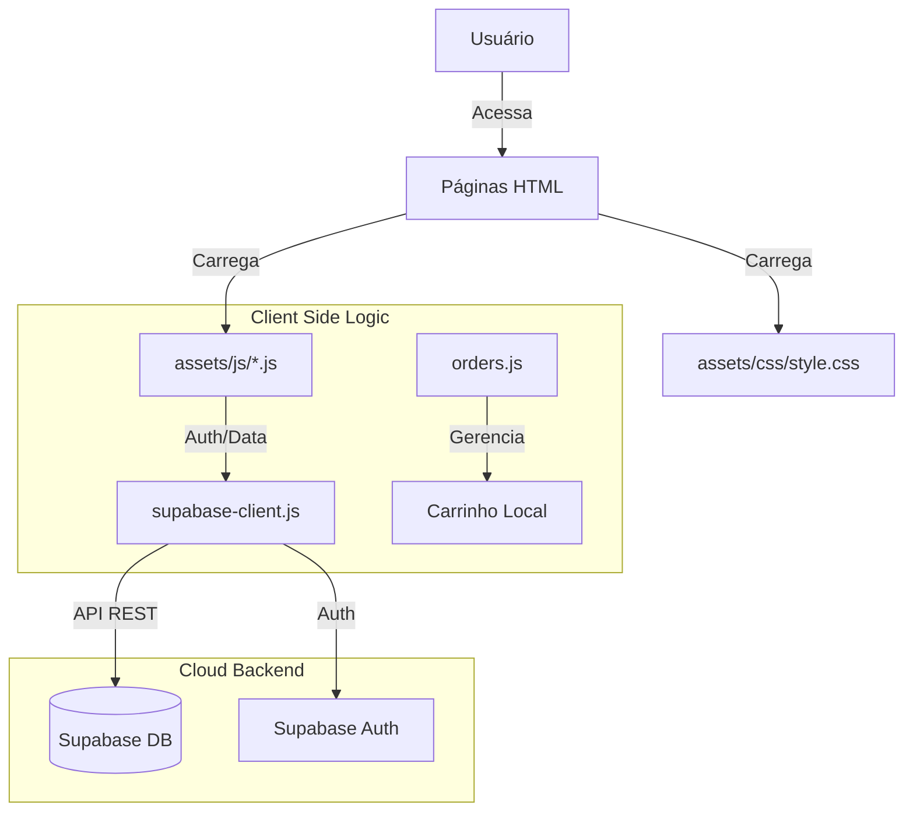

# Documentação para Agentes de IA (`AGENTS.md`)

> **Atualizado em:** 30/01/2026
> **Versão da Documentação:** 1.0

Este documento destina-se a orientar agentes de codificação de IA sobre a estrutura, arquitetura e convenções do projeto **Bar Los Hermanos**.

---

## 1. Visão Geral do Projeto

O **Bar Los Hermanos** é uma aplicação web estática (Client-Side) construída com tecnologias web fundamentais (HTML, CSS, JS) e integrada ao **Supabase** para backend as a service (BaaS). O sistema gerencia o cardápio, pedidos, autenticação de clientes e áreas de entrega.

### Tecnologias Principais

- **Frontend:** HTML5 Semântico, CSS3 (Vanilla + Variáveis), JavaScript (ES6+).
- **Backend/Banco de Dados:** Supabase (PostgreSQL, Auth, Realtime).
- **Bibliotecas Externas:**
  - [FontAwesome 6](https://fontawesome.com/) (Ícones)
  - [Google Fonts](https://fonts.google.com/) (Bebas Neue, Poppins)
  - [Supabase JS Client](https://supabase.com/docs/reference/javascript/installing) (via CDN)
- **Hospedagem:** Estática (sem necessidade de build Node.js).

---

## 2. Estrutura de Diretórios e Arquivos

A organização do projeto é híbrida: diretórios públicos (`assets`) e diretórios de desenvolvimento/documentação que não vão para produção (ignorados no git).

```bash
/
├── .gitignore           # Arquivos ignorados pelo Git
├── AGENTS.md            # [DEV] Este arquivo (Documentação Agente)
├── assets/              # Recursos estáticos (Público)
│   ├── css/             # Estilos (style.css, orders.css)
│   ├── img/             # Imagens otimizadas (webp/jpeg)
│   ├── js/              # Lógica Client-side (Supabase client, UI events)
│   ├── menu/            # PDFs do cardápio físico
│   └── video/           # Vídeos de background
├── db/                  # [DEV] Scripts SQL e Schema
├── debug/               # [DEV] Logs e relatórios de debug ocasionais
├── docs/                # [DEV] Documentação detalhada
│   └── doc_*.md           # Documentação de partes importantes do projeto
├── plans/               # [DEV] Planos de implementação e tarefas
│   └── implementation_plan-*.md     # Histórico de planejamentos complexos
└── *.html               # Páginas da aplicação (index, login, perfil, etc.)
```

### Principais Scripts (`assets/js/`)

- `supabase-client.js`: **Core**. Inicializa a conexão com Supabase e exporta funções auxiliares de Auth e Dados.
- `menu-service.js`: Lógica de busca e exibição do cardápio.
- `orders.js`: Gestão do carrinho de compras e checkout.
- `gallery.js`: Manipulação da galeria de imagens na homepage.

---

## 3. Arquitetura e Fluxo de Dados

### 3.1. Frontend

O projeto não utiliza frameworks SPA (Single Page Application) como React ou Vue. A navegação é tradicional (multi-page), mas utiliza JavaScript para interatividade dinâmica dentro de cada página (ex: adicionar ao carrinho, carregar itens do DB).

**Estilo (CSS):**

- Uso extensivo de **Variáveis CSS** (`:root`) em `style.css`.
- **Cores Principais:**
  - `--bg-color`: #000000 (Fundo)
  - `--accent-color`: #ff3131 (Destaque/Ação)
- **Tipografia:**
  - Títulos: `Bebas Neue`
  - Corpo: `Poppins`

### 3.2. Backend (Supabase)

A comunicação com o backend é direta do cliente via `supabase-client.js`.

- **Autenticação:** Supabase Auth (Email/Senha).
- **Segurança:** Row Level Security (RLS) ativado.
  - _Leitura:_ Pública para cardápio.
  - _Escrita:_ Restrita a admins (cardápio) ou usuários autenticados (seus próprios pedidos).

### 3.3. Banco de Dados (PostgreSQL)

Ver `schema_cardapio.md` para detalhes completos.

**Tabelas Principais:**

- `cardapio`: Itens à venda. Possui trigger para geração automática de SKU (`cod`).
- `clientes`: Perfil estendido do usuário (vinculado ao `auth.users`).
- `pedidos` & `itens_pedido`: Transações de vendas.
- `zonas_entrega`: Bairros e taxas de entrega.

---

## 4. Convenções de Desenvolvimento

### 4.1. Código

- **Idioma:** Português do Brasil (pt-BR) para variáveis, comentários e strings visíveis ao usuário.
- **Nomenclatura de Arquivos:** `kebab-case` (ex: `menu-service.js`, `pagina_pedido.html`).
- **JavaScript:** Preferência por `async/await` e funções puras onde possível.

### 4.2. UI/UX

- **Mobile First:** Todo CSS deve ser pensado primeiro para telas pequenas e expandido via `@media query`.
- **Feedback Visual:** Botões e cards devem ter estados `:hover` e feedback de clique.
- **Imagens:** Devem ter `alt` descritivo para acessibilidade.

---

## 5. Setup Inicial para Desenvolvimento

Como não há `npm` ou `bundler`, o projeto é "Plug & Play".

1.  **Requisitos:** Servidor web simples (ex: Live Server do VS Code).
2.  **Variáveis de Ambiente:** As chaves do Supabase estão expostas no frontend em `supabase-client.js` (padrão para clientes públicos, RLS garante a segurança).
3.  **Execução:**
    - Abra `index.html` via Live Server.
    - Navegue pelo site.

---

## 6. Diagrama de Fluxo (Simplificado)


