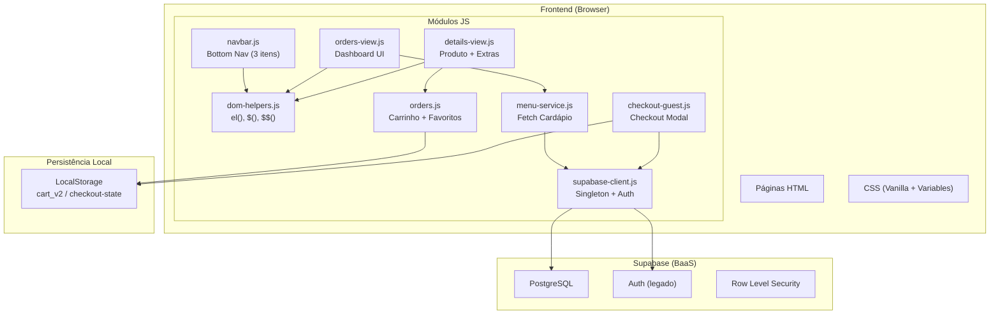
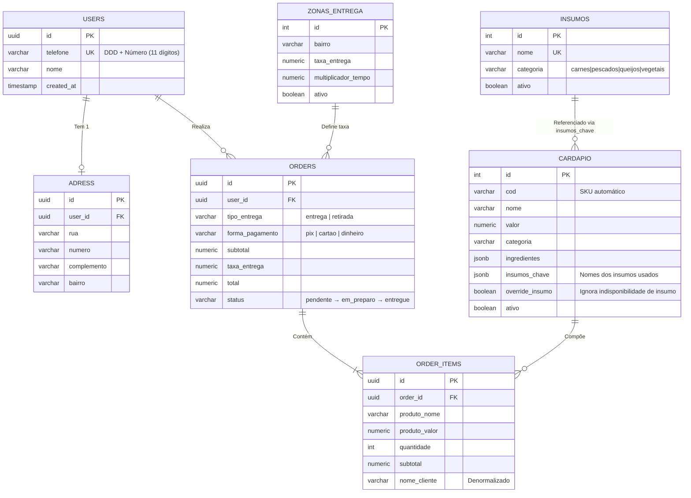
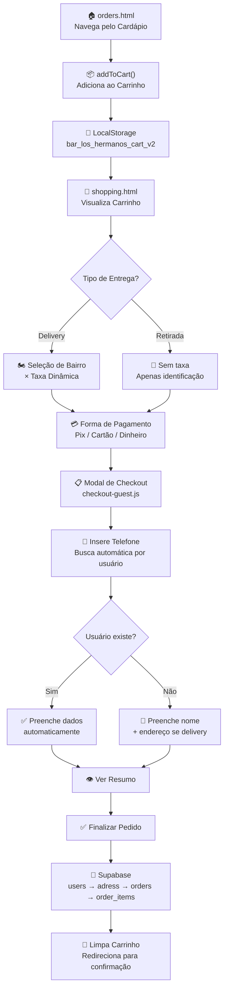

# Documentação para Agentes de IA (`AGENTS.md`)

> **Atualizado em:** 12/02/2026
> **Versão da Documentação:** 5.0
> **Versão do Projeto:** 2.1.0
> **Nível de Complexidade:** Médio
> **Tempo estimado para setup inicial:** ~5 minutos (Live Server + Supabase já configurado)

Este documento destina-se a orientar agentes de codificação de IA sobre a estrutura, arquitetura e convenções do projeto **Bar Los Hermanos**.

---

## 1. Visão Geral do Projeto

O **Bar Los Hermanos** é uma aplicação web **estática (Client-Side)** para um bar/restaurante localizado em Governador Valadares/MG, construída com tecnologias web fundamentais (HTML5, CSS3, JavaScript ES6+) e integrada ao **Supabase** como Backend as a Service (BaaS).

O sistema permite aos clientes navegar pelo cardápio digital, customizar pedidos com ingredientes e extras, gerenciar carrinho de compras e realizar pedidos para **entrega (delivery)** ou **retirada** — tudo **sem necessidade de login prévio** (Guest Checkout).

### 1.1 Funcionalidades Principais

- **Cardápio Digital Interativo:** Navegação por categorias (Comidas, Drinks, Cervejas, etc.) com dados do Supabase
- **Personalização de Pedidos:** Remoção de ingredientes e adição de extras com cálculo de preço em tempo real
- **Carrinho de Compras:** Adição de itens, cálculo de total, expiração automática (23:00) e persistência via LocalStorage
- **Checkout Simplificado (Guest Checkout v3):** Cadastro no momento do pedido via telefone, sem necessidade de login prévio
- **Sistema de Entrega:** Taxa calculada dinamicamente por bairro via tabela `zonas_entrega`
- **Design Responsivo:** Mobile-first, otimizado para celulares e desktops
- **Landing Page Institucional:** Hero com vídeo background, galeria de eventos e informações do bar

### 1.2 Tecnologias Principais

| Camada            | Tecnologia                                                                           | Versão/Detalhe         |
| ----------------- | ------------------------------------------------------------------------------------ | ---------------------- |
| **Frontend**      | HTML5, CSS3 (Vanilla + Variáveis CSS), JavaScript (ES6+ Modules)                     | Nativo, sem frameworks |
| **Backend/Banco** | Supabase (PostgreSQL, Auth, Realtime)                                                | Client SDK v2 (CDN)    |
| **Ícones**        | Material Symbols (Google), FontAwesome 6, Phosphor Icons                             | Via CDN                |
| **Fontes**        | Bebas Neue (títulos landing), Poppins (corpo landing), Plus Jakarta Sans (dashboard) | Google Fonts           |
| **CSS**           | Vanilla CSS com variáveis CSS (`:root`), arquitetura BEM                             | Mobile-first           |

### 1.3 Estrutura de Páginas HTML

| Página                  | Status    | Descrição                                                           |
| ----------------------- | --------- | ------------------------------------------------------------------- |
| `index.html`            | ✅ Ativa  | Landing page institucional com Hero Slider, Menu, Eventos e Galeria |
| `orders.html`           | ✅ Ativa  | Dashboard do cardápio — destaques e categorias dinâmicas            |
| `pagina_pedido.html`    | ✅ Ativa  | Detalhes do produto com extras, ingredientes e observações          |
| `shopping.html`         | ✅ Ativa  | Carrinho de compras e checkout com modal de identificação           |
| `painel.html`           | ✅ Ativa  | Painel administrativo — sidebar + gestão de Pratos/Insumos/Bebidas  |
| `historia.html`         | ✅ Ativa  | Página institucional sobre o bar                                    |
| `debug-connection.html` | 🛠️ Debug  | Teste de conexão com Supabase                                       |
| `login.html`            | 🚫 Legado | Tela de login (não usada no fluxo atual)                            |
| `cadastro.html`         | 🚫 Legado | Cadastro de novos clientes (não usada no fluxo atual)               |
| `perfil.html`           | 🚫 Legado | Perfil do usuário e histórico de pedidos                            |
| `favoritos.html`        | 🚫 Legado | Lista de itens favoritos do cliente                                 |
| `address.html`          | 🚫 Legado | Gerenciamento de endereços (substituído pelo fluxo simplificado)    |

---

## 2. Estrutura de Diretórios

```bash
/
├── .gitignore           # Arquivos ignorados pelo Git
├── AGENTS.md            # [DEV] Este arquivo (não versionado)
├── README.md            # Documentação pública do projeto
├── CHANGELOG.md         # Histórico de mudanças (SemVer / Keep a Changelog)
├── *.html               # Páginas da aplicação (ver seção 1.3)
│
├── assets/              # Recursos estáticos (PÚBLICO - versionado)
│   ├── css/             # Estilos CSS
│   │   ├── base/        # Fundamentos CSS
│   │   │   ├── reset.css        # Reset de estilos padrão do navegador
│   │   │   └── variables.css    # Variáveis CSS (cores, fontes, espaçamentos, raios, sombras)
│   │   │
│   │   ├── components/  # Componentes reutilizáveis (convenção BEM)
│   │   │   ├── button.css       # Estilos de botões
│   │   │   ├── card.css         # Estilos de cards de produto
│   │   │   ├── category-nav.css # Navegação de categorias horizontal
│   │   │   ├── form.css         # Estilos de formulários e inputs
│   │   │   └── navbar.css       # Barra de navegação inferior (bottom-nav)
│   │   │
│   │   ├── pages/       # Estilos específicos de páginas
│   │   │   ├── cart.css         # Carrinho de compras e checkout (~15KB)
│   │   │   ├── painel.css       # Painel admin: sidebar, cards, pills, insumos grid
│   │   │   └── product.css      # Página de detalhes do produto
│   │   │
│   │   ├── utils/       # Utilitários CSS
│   │   │   └── utilities.css    # Classes utilitárias (flex, grid, spacing)
│   │   │
│   │   ├── style.css        # Estilos da landing page (index.html) - ARQUIVO PRINCIPAL (~15KB)
│   │   ├── main.css         # Importador de estilos do dashboard/app
│   │   ├── orders.css       # Estilos adicionais do carrinho/checkout
│   │   └── styles_new.css   # Estilos auxiliares
│   │
│   ├── js/              # Lógica Client-side (12 módulos)
│   │   ├── supabase-client.js    # Cliente Supabase singleton + Auth helpers + Auth State Listener (230 linhas)
│   │   ├── dom-helpers.js        # Utilitários DOM: el(), $(), $$() (54 linhas)
│   │   ├── navbar.js             # Navbar global inferior simplificada (3 itens) (124 linhas)
│   │   ├── menu-service.js       # Serviço de dados do cardápio (fetch do Supabase)
│   │   ├── orders.js             # Lógica do Carrinho (LocalStorage V2) + Favoritos (578 linhas)
│   │   ├── orders-view.js        # Renderização do dashboard/cardápio + filtro de insumos (265 linhas)
│   │   ├── details-view.js       # Página de detalhes do produto + ingredientes + extras (240 linhas)
│   │   ├── painel.js             # Painel admin: sidebar, sub-tabs (Pratos/Insumos/Bebidas), cards, CRUD Supabase
│   │   ├── checkout-guest.js     # Fluxo de checkout simplificado Guest v3 (1204 linhas - MAIOR MÓDULO)
│   │   ├── checkout.js           # Checkout legado (não usado no fluxo atual)
│   │   ├── addresses.js          # API de gerenciamento de endereços (legada)
│   │   └── gallery.js            # Galeria de fotos da Home
│   │
│   ├── identidade_visual/  # Arquivo(s) de identidade visual do bar
│   ├── img/                 # Imagens otimizadas
│   │   ├── events/          # Fotos de eventos/artistas
│   │   └── sobre/           # Fotos do ambiente/história
│   ├── menu/                # PDFs do cardápio físico
│   └── video/               # Vídeos de background (Hero) - 3 arquivos
│
├── context-temp/        # [DEV] Sessões de trabalho (não versionado)
│   ├── last-session.json      # Contexto da última sessão
│   └── current_session.json   # Sessão ativa (milestones)
│
├── db/                  # [DEV] Scripts SQL e Schema (não versionado)
│   ├── migrations/            # Scripts de migração incrementais
│   │   └── 20260130_migracao_telefone.sql
│   ├── schema_tables.sql             # DDL das tabelas (legado)
│   ├── setup_guest_checkout_v3.sql   # Setup tabelas do novo fluxo (users, adress, orders, order_items)
│   ├── setup_insumos.sql             # Setup tabela insumos + colunas insumos_chave/override_insumo no cardápio
│   ├── setup_delivery.sql            # Setup zonas de entrega
│   ├── alter_order_items_add_cliente.sql  # Alteração: campo nome_cliente
│   ├── query_cardapio.sql            # Queries de consulta/inserção do cardápio
│   └── queries_exploratorias.sql     # Queries exploratórias/debug
│
├── docs/                # [DEV] Documentação detalhada (não versionado)
│   ├── doc_tables.md                 # Documentação do schema (com diagrama ER Mermaid)
│   ├── doc_menu.md                   # Documentação do cardápio
│   ├── doc_bugfixes_2026-01-31_carrinho.md   # Registro de bugfixes do carrinho
│   ├── doc_implementation_multiplos_enderecos_2026-01-31.md
│   ├── implementacao-cadastro-simplificado-v3.md  # Doc técnica do Guest Checkout
│   └── plan_implementation_multiplos_enderecos.md
│
├── plans/               # [DEV] Planos de implementação (não versionado)
│   ├── implementation-plan-v3.md              # Plano do Guest Checkout v3
│   ├── implementation-plan_painel-admin.md    # Plano do painel admin (~39KB)
│   ├── implementation-plan_painel-insumos.md  # Plano do sistema de insumos
│   ├── implementation-plan_2026-01-25_usuarios-e-bairros.md
│   ├── implementation-plan_2026-01-28_ingredientes.md
│   ├── implementation-plan_2026-01-30_padronizacao-telefone.md
│   ├── implementation-plan_2026-01-30_sistema-impressao.md
│   ├── implementation_plan_2026-01-31_isolamento-carrinho.md
│   └── 2026-01-08_dashboard-gestao-brainstorm.md
│
└── debug/               # [DEV] Relatórios de debug (não versionado)
    └── report_2026-01-24.md
```

> [!NOTE]
> Pastas marcadas com `[DEV]` estão no `.gitignore` e **não são versionadas**. São exclusivas para desenvolvimento/agentes de IA.

---

## 3. Arquitetura e Fluxo de Dados

### 3.1 Padrão de Arquitetura

O projeto segue um padrão **MVC Simplificado no Cliente**:

- **Model:** Supabase (PostgreSQL remoto) + LocalStorage (Carrinho local)
- **View:** Arquivos HTML (Estrutura) + `*-view.js` (Renderização Dinâmica via DOM)
- **Controller:** `orders.js`, `checkout-guest.js` (Regras de Negócio e Event Listeners)

### 3.2 Diagrama de Arquitetura



### 3.3 Gerenciamento de Estado

| Estado              | Persistência  | Chave/Local                                               |
| ------------------- | ------------- | --------------------------------------------------------- |
| Carrinho de Compras | LocalStorage  | `bar_los_hermanos_cart_v2` (formato novo)                 |
| Carrinho Legado     | LocalStorage  | `bar-los-hermanos-cart` (compatibilidade)                 |
| Estado do Checkout  | LocalStorage  | `bar-los-hermanos-checkout-state`                         |
| Perfil do Usuário   | Supabase      | Tabela `users` (novo fluxo) ou `clientes` (legado)        |
| Endereços           | Supabase      | Tabela `adress` (novo fluxo) ou `enderecos` (legado)      |
| Sessão do Usuário   | Supabase Auth | Cookies/Local (gerenciado pelo SDK) — **Não obrigatório** |

### 3.4 Comunicação entre Módulos

A arquitetura **não usa um state manager formal**. A comunicação ocorre via:

1. **ES Modules:** `import { el, $, $$ } from './dom-helpers.js'` (módulos modernos)
2. **Funções globais no `window`:** `window.addToCart`, `window.updateNavbarCartCount`, `window.filterMenuByCategory`
3. **LocalStorage:** Sincronização de estado do carrinho entre páginas
4. **Callbacks:** Passagem de funções entre módulos

### 3.5 Banco de Dados (Supabase PostgreSQL)

**Tabelas Ativas (Fluxo Guest Checkout v3):**

| Tabela          | Propósito                                                                                  | RLS                          |
| --------------- | ------------------------------------------------------------------------------------------ | ---------------------------- |
| `cardapio`      | Itens do menu com SKU, categoria, ingredientes (JSONB), `insumos_chave`, `override_insumo` | Leitura pública              |
| `insumos`       | Ingredientes-chave por categoria (carnes, pescados, queijos, vegetais) com flag `ativo`    | Leitura/atualização pública  |
| `users`         | Clientes cadastrados via checkout (telefone como chave única)                              | Inserção/atualização pública |
| `adress`        | Endereço de entrega (1:1 com users)                                                        | Inserção/atualização pública |
| `orders`        | Pedidos dos clientes (snapshot denormalizado)                                              | Inserção pública             |
| `order_items`   | Itens de cada pedido com `nome_cliente` denormalizado                                      | Inserção pública             |
| `zonas_entrega` | Configuração de bairros, taxas e tempo estimado                                            | Leitura pública              |

**Tabelas Legadas (não usadas no fluxo atual):**

- `clientes`, `enderecos`, `pedidos`, `itens_pedido`, `favoritos`

**Diagrama ER (Fluxo Atual):**



---

## 4. Módulos JavaScript — Referência Detalhada

### 4.1 `supabase-client.js` (230 linhas)

**Propósito:** Cliente singleton do Supabase + funções helpers de autenticação e API.

| Função                           | Assinatura                              | Descrição                                  |
| -------------------------------- | --------------------------------------- | ------------------------------------------ |
| `loginUser`                      | `loginUser(email, password)`            | Login via Auth (legado)                    |
| `signUpUser`                     | `signUpUser(email, password, userData)` | Cadastro via Auth (legado)                 |
| `logoutUser`                     | `logoutUser()`                          | Logout + limpa localStorage                |
| `checkSession`                   | `checkSession()`                        | Verifica sessão ativa                      |
| `getUserProfile`                 | `getUserProfile(userId)`                | Busca perfil na tabela `clientes`          |
| `getFavorites`                   | `getFavorites(userId)`                  | Lista favoritos com JOIN em `cardapio`     |
| `addFavorite` / `removeFavorite` | `(userId, itemId)`                      | CRUD de favoritos                          |
| `getDeliveryZone`                | `getDeliveryZone(bairro)`               | Busca zona específica (ILIKE)              |
| `getDeliveryZones`               | `getDeliveryZones()`                    | Lista todas zonas ativas                   |
| `createOrder`                    | `createOrder(orderPayload)`             | Insere pedido na tabela `pedidos` (legado) |
| `createOrderItems`               | `createOrderItems(itemsPayload)`        | Insere itens em `itens_pedido` (legado)    |

**Importante:** Inclui um `Auth State Listener` (`onAuthStateChange`) que gerencia isolamento de carrinho por usuário, migração de carrinho legado e limpeza ao logout.

### 4.2 `dom-helpers.js` (54 linhas)

**Propósito:** Utilitários de criação segura de elementos DOM (padrão "jQuery light").

```javascript
// Cria elementos DOM de forma declarativa
export const el = (tag, props = {}, children = []) => { ... };

// Seletores
export const $ = (selector, context = document) => context.querySelector(selector);
export const $$ = (selector, context = document) => [...context.querySelectorAll(selector)];
```

**Capacidades do `el()`:** Atributos HTML, event listeners (`on*`), classes CSS, dataset, estilos inline, filhos (Node ou texto).

### 4.3 `navbar.js` (124 linhas)

**Propósito:** Barra de navegação inferior simplificada (3 itens, sem login).

- **Itens:** Início (`index.html`), Cardápio (`orders.html`), Carrinho (`shopping.html`)
- **Funções globais:** `window.updateNavbarCartCount` — atualiza badge do carrinho
- **`highlightActiveLink()`** — Mapeia caminho da URL para o item ativo da navbar
- **Ícones:** Material Symbols: `home`, `restaurant_menu`, `shopping_cart`

### 4.4 `orders.js` (578 linhas)

**Propósito:** Lógica completa do carrinho de compras (V2) + sistema de favoritos.

**Constantes:**

- `CART_STORAGE_KEY = 'bar_los_hermanos_cart_v2'`
- `LEGACY_CART_KEY = 'bar-los-hermanos-cart'`

**Funções principais:**

| Função                                                        | Descrição                                                      |
| ------------------------------------------------------------- | -------------------------------------------------------------- |
| `getCart()`                                                   | Carrega itens do carrinho (validação + compatibilidade legado) |
| `saveCart(items)`                                             | Salva no localStorage (sem exigir auth)                        |
| `addToCart(name, price, img_url, removedIngredients, extras)` | Adiciona item com personalização                               |
| `updateCartUI()`                                              | Renderiza a lista de itens no carrinho                         |
| `changeQuantity(index, delta)`                                | Altera quantidade (+/-)                                        |
| `removeFromCart(index)`                                       | Remove item do carrinho                                        |
| `isCartValid(cartData)`                                       | Validação: expiração (23:00) e integridade                     |
| `migrateLegacyCart()`                                         | Migra carrinho formato antigo para V2                          |
| `toggleFavorite(name, price, image)`                          | Adiciona/remove favorito no Supabase                           |
| `updateFavoritesUI()`                                         | Renderiza lista de favoritos                                   |

### 4.5 `orders-view.js` (265 linhas)

**Propósito:** Renderização do dashboard do cardápio + filtro de insumos. Usa ES Modules.

**Filtro de insumos (frontend público):**

- `getInsumosInativos()` — Carrega e cacheia nomes de insumos inativos
- `filterByInsumos(items)` — Remove pratos com insumos inativos (respeita `override_insumo`)
- Aplicado automaticamente nas funções de fetch: `getFeaturedItems()`, `getAllItems()`, `getItemsByCategory()`

**Funções:** `getFeaturedItems()`, `getAllItems()`, `getItemsByCategory()`, `loadFeatured()`, `loadPopular()`, `renderGridItems()`, `filterByCategory()`, `renderCategoryList()`.

### 4.8 `painel.js` (Painel Administrativo)

**Propósito:** Lógica completa do painel admin. Sidebar + 3 sub-tabs + CRUD via Supabase.

**Sub-tabs:**

| Sub-tab     | Conteúdo                                                            |
| ----------- | ------------------------------------------------------------------- |
| **Pratos**  | Cards visuais com imagem/nome/preço/badge, filtro por pills e busca |
| **Insumos** | Grid de 4 colunas (Carnes/Pescados/Queijos/Vegetais), 2 cards/linha |
| **Bebidas** | Cards visuais semelhantes a Pratos, com busca independente          |

**Lógica de status dos pratos:**

| Status     | Condição                             | Ação ao clicar  |
| ---------- | ------------------------------------ | --------------- |
| Ativo      | `ativo=true`, insumos OK             | Desativa        |
| Desativado | `ativo=false`                        | Reativa         |
| Insumo     | `ativo=true`, insumo inativo         | Ativa override  |
| Override   | `ativo=true`, `override_insumo=true` | Remove override |

**Funções principais:** `loadData()`, `renderPratos()`, `renderInsumos()`, `renderBebidas()`, `renderStats()`, `renderCategoryPills()`, `toggleInsumo()`, `togglePrato()`, `overridePrato()`, `removeOverride()`.

### 4.6 `details-view.js` (240 linhas)

**Propósito:** Página de detalhes do produto com ingredientes removíveis e extras.

- **`INGREDIENT_ICONS`:** Mapeamento de ingredientes para ícones Phosphor Icons
- **Estado local:** `removedIngredients` (Set), `selectedExtras` (Map), `currentProduct`, `basePrice`
- **Cálculo de preço:** `calculateTotalPrice()` = `basePrice` + soma dos extras selecionados
- **`renderIngredients()`:** Gera botões interativos para cada ingrediente com toggle visual

### 4.7 `checkout-guest.js` (1204 linhas — MAIOR MÓDULO)

**Propósito:** Fluxo completo de checkout simplificado (Guest Checkout v3).

**Estado global do checkout:**

```javascript
window.checkoutStateGlobal = {
  tipoEntrega: "entrega",
  formaPagamento: "pix",
  troco: "",
  telefone: "",
  nome: "",
  endereco: null,
  observacoes: "",
  dadosCompletos: false,
};
```

**Seções do módulo:**

1. **Funções da página do carrinho:** `selecionarTipoEntrega()`, `atualizarFormaPagamento()`, `atualizarTotalCarrinho()`
2. **Formatação de telefone:** `formatarDDD()`, `formatarNumeroTelefone()`, `montarTelefoneCompleto()`
3. **API Supabase:** `buscarUsuarioPorTelefone()`, `salvarUsuario()`, `salvarEndereco()`, `criarPedido()`
4. **Controle do Modal:** `initCheckoutModal()`, `abrirCheckoutModal()`, `fecharCheckoutModal()`, `setupEventListeners()`
5. **Submissão:** `submitOrder()` — orquestra todo o fluxo de salvamento

---

## 5. Convenções de Código

### 5.1 JavaScript

**Módulos:**

- Arquivos modernos usam ES Modules (`import/export`)
- Compatibilidade com scripts tradicionais via exposição no `window`

```javascript
// ES Modules - importação
import { el, $, $$ } from './dom-helpers.js';

// Exposição global (quando necessário para interop)
window.updateNavbarCartCount = function() { ... };
window.addToCart = addToCart;
```

**APIs globais expostas no `window`:**

- `window.supabaseClient` — Cliente Supabase inicializado
- `window.addToCart`, `window.getCart`, `window.saveCart` — Funções do carrinho
- `window.checkoutStateGlobal` — Estado global do checkout
- `window.currentUserId` — ID do usuário logado (se houver)
- `window.filterMenuByCategory` — Filtro de categorias

**Async/Await:** Obrigatório para todas as chamadas ao Supabase:

```javascript
async function loadData() {
  const { data, error } = await supabaseClient.from("cardapio").select("*");
  if (error) throw error;
  return data;
}
```

**DOM Manipulation:** Preferência pelo `el()` do `dom-helpers.js`:

```javascript
// ✅ Correto
const card = el("div", { class: "card" }, [
  el("h3", {}, "Título"),
  el("p", {}, "Descrição"),
]);

// ❌ Evitar innerHTML complexo
container.innerHTML = `<div class="card"><h3>Título</h3>...</div>`;
```

**Logging com prefixos:**

```javascript
console.log("[Cart] Mensagem do carrinho");
console.log("[Checkout] Evento:", event);
console.log("[Auth] Estado:", session);
```

**Nomes de variáveis:** Em inglês (padrão global).
**Comentários:** Em português.

### 5.2 CSS

**Arquitetura:**

- **Mobile-First:** Media queries para telas maiores (`min-width`)
- **CSS Variables:** Definidas em `:root` em `assets/css/base/variables.css`
- **BEM (Block Element Modifier):** Convenção de nomenclatura

**Variáveis CSS disponíveis (`variables.css`):**

| Categoria        | Exemplos                                                                                                                |
| ---------------- | ----------------------------------------------------------------------------------------------------------------------- |
| **Cores**        | `--color-primary: #ff3131`, `--color-bg-dark: #000`, `--color-surface-dark: #1a130c`, `--color-text-secondary: #cbad90` |
| **Opacidades**   | `--color-white-5` a `--color-white-60`, `--color-black-60`                                                              |
| **Fontes**       | `--font-display`, `--font-body`: Plus Jakarta Sans; `--font-title-alt`: Bebas Neue                                      |
| **Espaçamentos** | `--spacing-container: 1.25rem`, `--header-height: 80px`, `--navbar-height: 84px`                                        |
| **Raios**        | `--radius-sm` a `--radius-full`                                                                                         |
| **Sombras**      | `--shadow-sm`, `--shadow-lg`, `--shadow-glow`                                                                           |

**Convenção BEM:**

```css
.cart-item {
} /* Block */
.cart-item__image {
} /* Element */
.cart-item__qty-btn--add {
} /* Modifier */
```

**Organização dos arquivos CSS:**

- `style.css` — Landing page (index.html) — **15KB, arquivo principal**
- `main.css` — Importador de estilos base do app
- `base/` → `reset.css`, `variables.css`
- `components/` → `button.css`, `card.css`, `category-nav.css`, `form.css`, `navbar.css`
- `pages/` → `cart.css` (~15KB), `product.css` (~9KB)
- `utils/` → `utilities.css`

### 5.3 HTML

**Semântica e Acessibilidade:**

- Tags semânticas (`<header>`, `<section>`, `<footer>`)
- Atributos `aria-label` em formulários
- Classes `.sr-only` para labels invisíveis (screen readers)
- `loading="lazy"` em imagens pesadas

**Inclusão de Scripts (ordem obrigatória):**

```html
<!-- 1. SDK do Supabase via CDN -->
<script src="https://cdn.jsdelivr.net/npm/@supabase/supabase-js@2"></script>
<!-- 2. Cliente singleton -->
<script src="assets/js/supabase-client.js"></script>
<!-- 3. Lógica de negócio -->
<script src="assets/js/orders.js"></script>
<!-- 4. Navbar (módulo ES) -->
<script type="module" src="assets/js/navbar.js"></script>
```

---

## 6. Build, Deploy e Ambiente

### 6.1 Pré-requisitos

**NÃO requer Node.js/npm** para rodar. É uma aplicação estática pura.

Para desenvolvimento local:

- Extensão **Live Server** (VS Code) ou qualquer servidor HTTP estático
- Navegador moderno com suporte a ES Modules
- Acesso à internet (CDNs e Supabase)

### 6.2 Configuração do Supabase

As credenciais estão hardcoded em `assets/js/supabase-client.js`:

```javascript
const SUPABASE_URL = "https://bdkqoyalqrypfzwijosd.supabase.co";
const SUPABASE_KEY = "eyJhbGciOiJIUzI1NiIs..."; // Anon key (pública)
```

**Segurança:** A chave é a `anon key` (pública). A segurança real vem do **Row Level Security (RLS)** configurado no PostgreSQL.

### 6.3 Deploy

Aplicação compatível com qualquer serviço de hosting estático:

- Vercel / Netlify / GitHub Pages / Firebase Hosting

**Processo:**

1. Push do código para o repositório Git
2. Conectar serviço de hosting à pasta raiz
3. Nenhuma etapa de build necessária

### 6.4 Arquivos Ignorados pelo Git (`.gitignore`)

| Item                    | Motivo                                  |
| ----------------------- | --------------------------------------- |
| `/.agent`               | Configurações de agentes de IA          |
| `/context-temp`         | Sessões de trabalho temporárias         |
| `/db`                   | Scripts SQL sensíveis                   |
| `/debug`                | Relatórios de debug                     |
| `/plans`                | Planos de implementação internos        |
| `/brainstorms`          | Notas de brainstorming                  |
| `AGENTS.md`             | Documentação para agentes (não público) |
| `.gitignore`            | O próprio arquivo                       |
| `.env` / `.env.example` | Variáveis de ambiente                   |
| `debug-connection.html` | Página de debug                         |

---

## 7. Fluxos Principais

### 7.1 Fluxo de Compra (Guest Checkout v3)



### 7.2 Carrinho — Adição de Item

```
pagina_pedido.html → details-view.js
    → Usuário personaliza (ingredientes ± extras)
    → Clica "Adicionar"
    → window.addToCart(name, price, img_url, removedIngredients, extras)
    → orders.js → saveCart() → LocalStorage (bar_los_hermanos_cart_v2)
    → updateCartBadge() → Atualiza Badge na Navbar
    → Redireciona para shopping.html
```

### 7.3 Validação do Carrinho

```
Ao carregar qualquer página:
    → orders.js DOMContentLoaded
    → getCart() → Lê localStorage
    → isCartValid(cartData)
        → Verifica se é do mesmo dia
        → Verifica se é antes de 23:00
        → Se inválido: clearCartStorage()
    → updateCartBadge()
```

---

## 8. Regras de Negócio

| Funcionalidade        | Limite/Regra                                                            |
| --------------------- | ----------------------------------------------------------------------- |
| Endereços por usuário | Máximo 1 no fluxo simplificado (tabela `adress`)                        |
| Expiração do carrinho | Fim do dia (23:00)                                                      |
| Modos de entrega      | Delivery / Retirada                                                     |
| Formas de pagamento   | Pix / Cartão / Dinheiro                                                 |
| Troco                 | Apenas para pagamento em Dinheiro                                       |
| Telefone              | DDD (2 dígitos) + Número (8 ou 9 dígitos). Se 8, adiciona '9' na frente |
| DDD padrão local      | 33 (Governador Valadares/MG)                                            |
| Bairros               | Carregados dinamicamente de `zonas_entrega`                             |
| Taxa de entrega       | Calculada por bairro (coluna `taxa_entrega`)                            |
| SKU de produtos       | Gerado automaticamente por trigger no PostgreSQL                        |
| Ingredientes          | Personalizáveis (remoção) via JSONB na tabela `cardapio`                |

---

## 9. Guia de Desenvolvimento

### 9.1 Adicionar Nova Página

1. Criar arquivo HTML na raiz
2. Incluir scripts na ordem obrigatória (ver seção 5.3)
3. Adicionar mapeamento em `navbar.js` → `highlightActiveLink()` → objeto `activeMapping`
4. Seguir estrutura CSS existente (criar arquivo em `pages/` se necessário)

### 9.2 Adicionar Nova Categoria ao Cardápio

1. Inserir itens no banco Supabase com a nova categoria
2. Adicionar ícone em `orders-view.js` → ícones no `renderCategoryList()`
3. Adicionar à ordenação `CATEGORY_ORDER` se necessário

### 9.3 Debug e Troubleshooting

- Usar `debug-connection.html` para testar conexão com Supabase
- Console do navegador mostra logs prefixados (`[Cart]`, `[Checkout]`, `[Auth]`)
- Dados do carrinho: `localStorage.getItem('bar_los_hermanos_cart_v2')`
- Estado do checkout: `localStorage.getItem('bar-los-hermanos-checkout-state')`

### 9.4 Chaves de LocalStorage

| Chave                             | Propósito                         | Formato                                                          |
| --------------------------------- | --------------------------------- | ---------------------------------------------------------------- |
| `bar_los_hermanos_cart_v2`        | Carrinho V2 (ativo)               | `{ userId, createdAt, items[] }`                                 |
| `bar-los-hermanos-cart`           | Carrinho legado (compatibilidade) | `items[]`                                                        |
| `bar-los-hermanos-checkout-state` | Estado do checkout                | `{ tipoEntrega, formaPagamento, telefone, nome, endereco, ... }` |

---

## 10. Contexto de Sessões de Trabalho

O projeto utiliza o diretório `context-temp/` para manter contexto entre sessões de desenvolvimento:

- **`last-session.json`:** Contém título, resumo, decisões, problemas enfrentados, próximos passos e arquivos modificados da última sessão. Consultar antes de iniciar trabalho para continuidade.
- **`current_session.json`:** Sessão ativa, com milestones registrados durante o trabalho.

### 10.1 Próximos Passos Planejados (da última sessão)

| Prioridade | Tarefa                                                                             |
| ---------- | ---------------------------------------------------------------------------------- |
| 🔴 Alta    | Corrigir override e desativação direta de produtos no painel (clique não funciona) |
| 🔴 Alta    | Implementar envio de confirmação de pedido via WhatsApp                            |
| 🟡 Média   | Implementar seção Agenda no painel (gestão de eventos)                             |
| 🟡 Média   | Criar página de histórico de pedidos acessível por telefone (sem login)            |
| 🟡 Média   | Implementar favoritos por telefone (vinculado a `users`)                           |
| 🟢 Baixa   | Implementar seção Métricas no painel (pedidos, faturamento)                        |
| 🟢 Baixa   | Implementar autenticação do painel admin (PIN ou login)                            |
| 🟢 Baixa   | Criar sistema de cupom de desconto/fidelidade                                      |

---

## 11. Migrações e Versões

### 11.1 Histórico de Versões

| Versão    | Data       | Destaque                                            |
| --------- | ---------- | --------------------------------------------------- |
| **2.1.0** | 2026-02-12 | Painel admin v2 + sistema de insumos                |
| **2.0.0** | 2026-01-31 | Guest Checkout v3 — cadastro simplificado sem login |
| **1.3.0** | 2026-01-31 | Sistema de múltiplos endereços                      |
| **1.2.0** | 2026-01-30 | Smart Phone Logic + padronização telefone           |
| **1.1.0** | 2026-01-30 | Extras dinâmicos, migração Tailwind→Vanilla CSS     |
| **1.0.0** | 2025-12-31 | SEO completo, acessibilidade, sistema de auth       |
| **0.9.0** | 2025-12-30 | Redesign seção Menu, padronização títulos           |

### 11.2 Compatibilidade Retroativa

O código mantém compatibilidade com versões anteriores:

- Carrinho legado (`bar-los-hermanos-cart`) é migrado automaticamente para V2
- Campos em inglês (`name`, `price`, `quantity`) são normalizados para português (`nome`, `preco`, `quantidade`)
- Tabelas legadas (`clientes`, `enderecos`, `pedidos`, `itens_pedido`) permanecem no banco

---

## 12. Referências

- [Supabase JS Client Docs](https://supabase.com/docs/reference/javascript/installing)
- [Material Symbols](https://fonts.google.com/icons)
- [Phosphor Icons](https://phosphoricons.com/)
- [BEM Methodology](https://en.bem.info/methodology/)
- [Keep a Changelog](https://keepachangelog.com/en/1.1.0/)

---

**Desenvolvido por:** Douglas Furbino
**Contato:** (Ver README.md)
