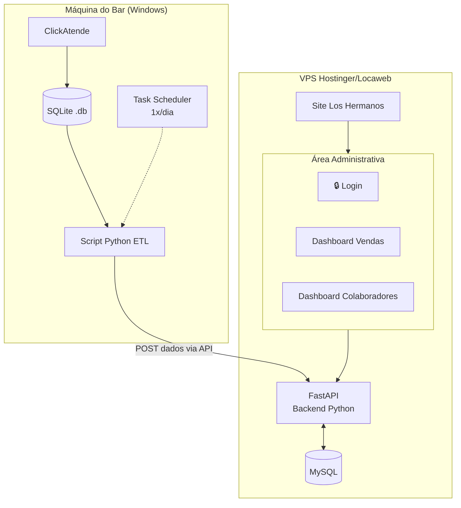
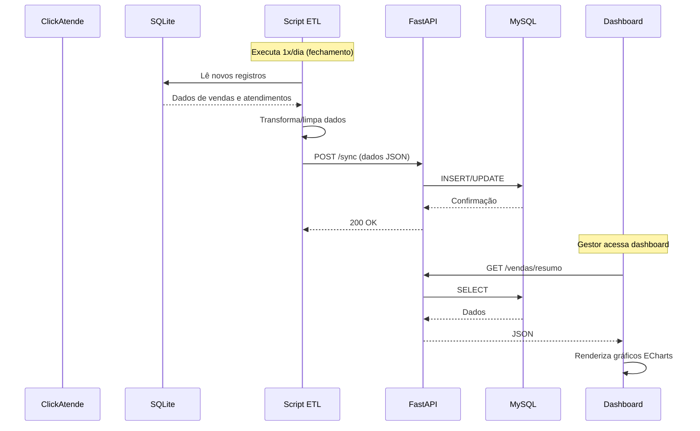
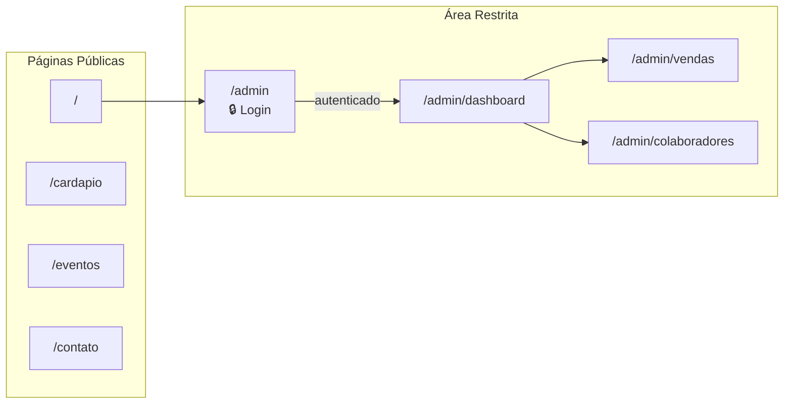
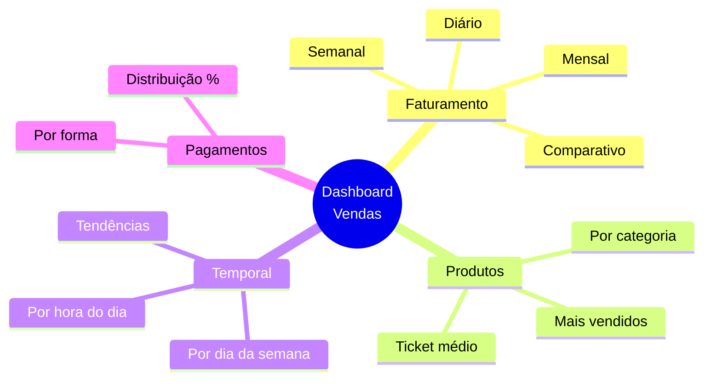
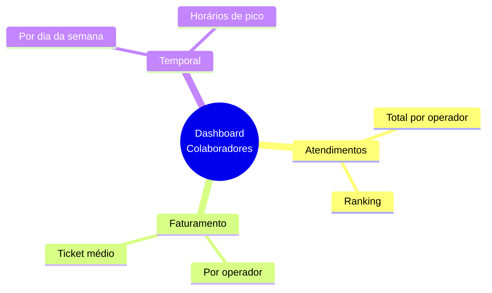
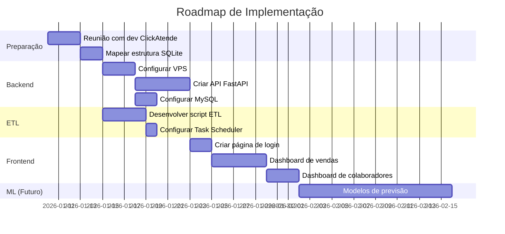

# Dashboard de Gestão - Análise Técnica

> Brainstorm realizado em 08/01/2026 para definição de arquitetura do sistema de dashboard administrativo do Bar Los Hermanos.

---

## Objetivo

Implementar área administrativa (`/admin`) no site com:

- Login exclusivo para gestores
- Dashboard de análise de vendas
- Dashboard de análise de colaboradores
- Preparação para modelos de Machine Learning futuros

---

## Arquitetura do Sistema

---

## Fluxo de Dados

---

## Stack Tecnológica

| Camada            | Tecnologia           | Justificativa                                 |
| ----------------- | -------------------- | --------------------------------------------- |
| **Origem**        | SQLite               | Banco nativo do ClickAtende                   |
| **ETL**           | Python + requests    | Leitura SQLite + envio HTTP                   |
| **Agendamento**   | Task Scheduler (Win) | Nativo do Windows                             |
| **Backend**       | FastAPI              | Leve, async, tipado, ideal para ML            |
| **Banco destino** | MySQL                | Incluso no VPS, robusto                       |
| **Frontend**      | HTML + CSS + JS      | Integrado ao site existente                   |
| **Gráficos**      | Apache ECharts       | Performance, temas, suporte a grandes volumes |
| **Autenticação**  | Usuário/senha config | Simples para 1-2 gestores                     |

---

## Estrutura de Páginas

---

## Decisões Técnicas

### Escolhidas

| Decisão        | Opção             | Motivo                                         |
| -------------- | ----------------- | ---------------------------------------------- |
| Arquitetura    | ETL → API → MySQL | Isolamento, escalabilidade, ML-ready           |
| Frequência ETL | 1x/dia            | Dados de fechamento são suficientes            |
| Backend        | Python (FastAPI)  | Unifica linguagem ETL + API + ML               |
| Gráficos       | Apache ECharts    | Performance com grandes volumes, temas prontos |
| Tema visual    | Dark Admin        | Diferenciado do site público                   |
| Hospedagem     | VPS               | Controle total, suporte a Python               |

### Descartadas

| Opção                 | Motivo do descarte                       |
| --------------------- | ---------------------------------------- |
| Leitura direta SQLite | Risco de lock, não escalável             |
| GitHub Pages          | Não suporta backend                      |
| Chart.js              | Menos recursos para analytics pesado     |
| D3.js                 | Complexidade desnecessária para o escopo |
| Multi-tenant auth     | Apenas 1-2 gestores                      |

---

## Métricas do Dashboard

### Vendas

### Colaboradores

---

## Próximos Passos

---

## Checklist para Reunião com ClickAtende

- [ ] Obter caminho do arquivo `.db`
- [ ] Verificar se banco é único ou múltiplos
- [ ] Solicitar acesso de leitura seguro
- [ ] Identificar tabelas de vendas/pedidos
- [ ] Identificar tabela de produtos
- [ ] Verificar campo de operador/colaborador
- [ ] Confirmar campos de data/hora
- [ ] Verificar formas de pagamento
- [ ] Identificar status de cancelamentos
- [ ] Solicitar cópia do banco para testes

---

## Arquivos Relacionados

| Arquivo                                                    | Descrição                                     |
| ---------------------------------------------------------- | --------------------------------------------- |
| [`queries_exploratorias.sql`](./queries_exploratorias.sql) | Queries SQL para explorar o banco ClickAtende |

---

## Pendências

- [ ] Configuração do VPS (aguardando momento certo)
- [ ] Discussão de layout do dashboard (próximo brainstorm)
- [ ] Definição de métricas específicas de ML
