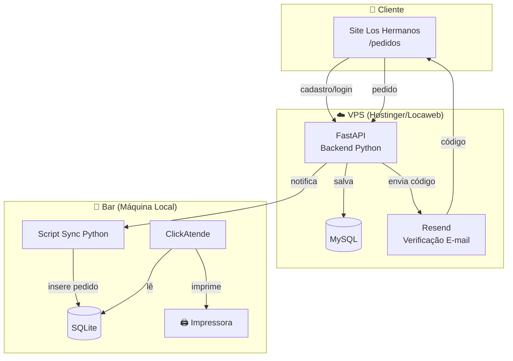
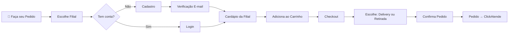
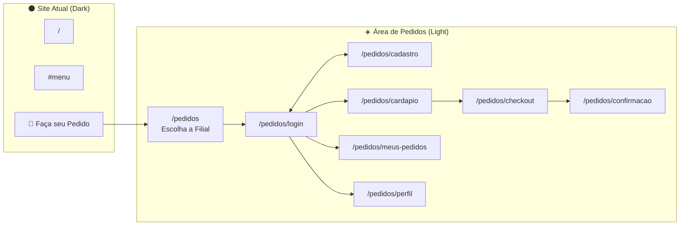
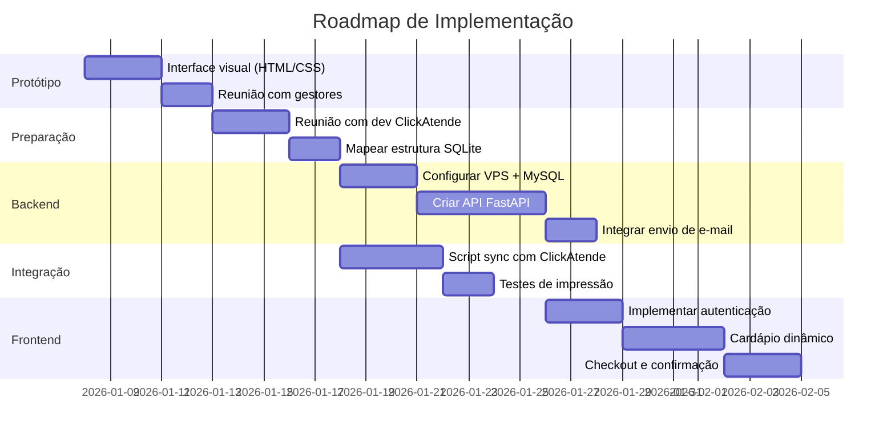

# Sistema de Pedidos Online - Análise Técnica

> Brainstorm realizado em 08/01/2026 para definição do sistema de pedidos online do Bar Los Hermanos.

---

## Objetivo

Implementar área de pedidos online (`/pedidos`) no site com:

- Cadastro e login de clientes
- Cardápio interativo por filial
- Carrinho de compras
- Checkout com opção de delivery ou retirada
- Integração com ClickAtende (impressora de pedidos)

---

## Arquitetura do Sistema

---

## Fluxo do Cliente

---

## Decisões Técnicas

### Escolhidas

| Decisão      | Opção                             | Motivo                                |
| ------------ | --------------------------------- | ------------------------------------- |
| Tema visual  | Light (claro)                     | Familiaridade com iFood/Rappi         |
| Cardápio     | Grid estilo iFood                 | UX moderna, cards grandes             |
| Carrinho     | Página separada (checkout)        | Fluxo limpo, mobile-friendly          |
| Autenticação | Login tradicional (email + senha) | Simplicidade para v1                  |
| Verificação  | E-mail (Resend - gratuito)        | 3.000 emails/mês grátis               |
| Pagamento    | Na entrega/retirada               | Simplifica v1, sem gateway            |
| Filial       | Cliente escolhe primeiro          | Evita itens indisponíveis no carrinho |
| Endereço     | Múltiplos salvos no perfil        | Conveniência para cliente             |
| Cobertura    | Bairros específicos de GV         | Controle de logística                 |
| Horário      | Mesmo do bar                      | Consistência operacional              |

### Descartadas

| Opção                       | Motivo do descarte                       |
| --------------------------- | ---------------------------------------- |
| Tema dark para pedidos      | Apps de delivery usam claro (melhor UX)  |
| Pagamento online (v1)       | Complexidade de gateway, taxas           |
| Login só com código (OTP)   | Cliente prefere criar conta tradicional  |
| Escolher filial no checkout | Pode ter itens indisponíveis no carrinho |
| SMS para verificação        | Custo, complexidade (deixar para v2)     |

---

## Estrutura de Páginas

---

## Paleta de Cores (Área de Pedidos)

| Elemento         | Cor                   | Hex       |
| ---------------- | --------------------- | --------- |
| Fundo principal  | Cinza claro           | `#F5F5F5` |
| Cards/Modais     | Branco                | `#FFFFFF` |
| Texto principal  | Cinza escuro          | `#333333` |
| Texto secundário | Cinza médio           | `#666666` |
| Accent/CTAs      | Vermelho Los Hermanos | `#FF3131` |
| Sucesso          | Verde                 | `#28A745` |
| Erro             | Vermelho escuro       | `#DC3545` |

---

## Dados do Cliente (Cadastro)

| Campo         | Obrigatório          | Validação               |
| ------------- | -------------------- | ----------------------- |
| Nome completo | ✅                   | Mínimo 3 caracteres     |
| E-mail        | ✅                   | Formato válido, único   |
| Celular       | ✅                   | Formato (XX) XXXXX-XXXX |
| Senha         | ✅                   | Mínimo 6 caracteres     |
| Endereço      | ❌ (adiciona depois) | CEP válido              |

---

## Pendências para Reunião com Gestores

- [ ] Definir bairros de cobertura do delivery
- [ ] Taxa de entrega: fixa ou por bairro?
- [ ] Quais itens disponíveis para delivery? (todos ou seleção?)
- [ ] Valor mínimo para pedido delivery?
- [ ] Horário de corte para pedidos (ex: último 22h30?)
- [ ] Promoções específicas para pedidos online?
- [ ] Quem gerencia pedidos em cada filial?

---

## Pendências para Reunião com Dev ClickAtende

- [ ] Estrutura das tabelas de pedidos no SQLite
- [ ] É possível inserir pedidos externos no banco?
- [ ] Como funciona a impressão automática?
- [ ] Existe API ou precisa inserção direta no SQLite?
- [ ] Campos obrigatórios para um pedido válido
- [ ] Como são tratados cancelamentos?

---

## Próximos Passos

---

## Arquivos Relacionados

| Arquivo                                                                                    | Descrição                               |
| ------------------------------------------------------------------------------------------ | --------------------------------------- |
| [`2026-01-08_dashboard-gestao-brainstorm.md`](./2026-01-08_dashboard-gestao-brainstorm.md) | Brainstorm do dashboard administrativo  |
| `queries_exploratorias.sql`                                                                | Queries para explorar banco ClickAtende |

---

## Observações

- O sistema de pedidos online é **independente** do dashboard de gestão
- Ambos compartilham a mesma fonte de dados (ClickAtende/SQLite)
- A API FastAPI pode servir ambos os sistemas
- O tema claro da área de pedidos contrasta intencionalmente com o site dark
