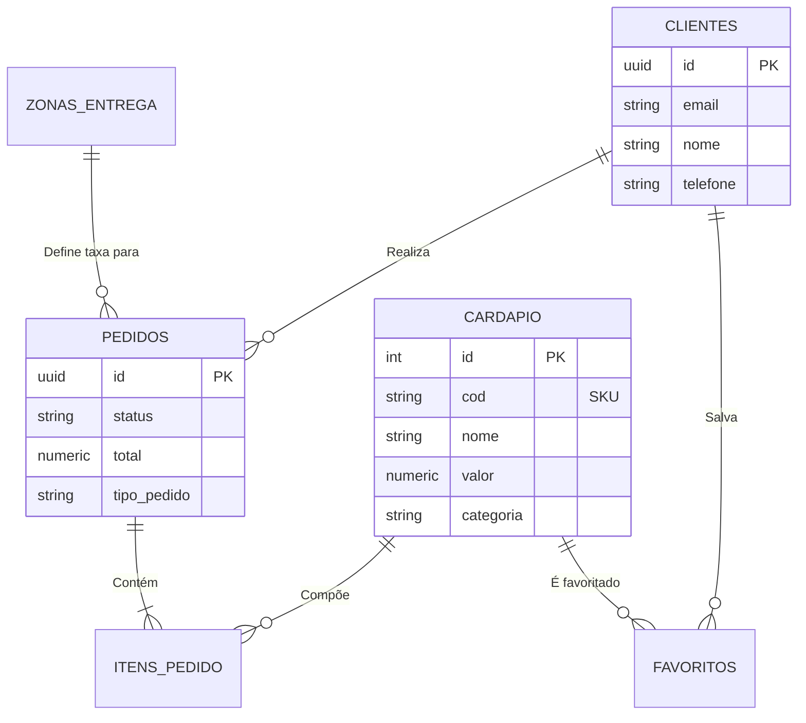

# Documentação do Banco de Dados: Tabelas

Este documento descreve a estrutura do banco de dados do **Bar Los Hermanos**, detalhando o papel de cada tabela e como elas se relacionam para suportar as operações de cardápio digital, pedidos e entregas.

---

## 🗺️ Diagrama de Relacionamentos (ER)

Abaixo, uma visão geral visual de como as entidades se conectam.

---

## 📦 Tabelas e Funcionalidades

### 1. `cardapio` (Catálogo de Produtos)

Armazena todos os itens vendáveis do bar. É a tabela central para a exibição no site.

- **Funcionalidade Principal:** Alimentar a página principal e o cardápio digital.
- **Campos Chave:**
  - `cod`: Código visual unívoco (SKU) gerado automaticamente (ex: `btts-001`).
  - `categoria`: Agrupador para facilitar a navegação (drinks, petiscos, etc.).
  - `ativo`: Boleano para ocultar itens temporariamente sem deletá-los (ex: produto em falta).
  - `ingredientes`: Coluna JSONB para listar componentes (ex: "Cebola", "Bacon").

### 2. `clientes` (Perfil do Usuário)

Mantém os dados cadastrais e de entrega dos usuários registrados.

- **Interação:** Criada automaticamente via gatilho quando um usuário se cadastra no Supabase Auth.
- **Dados Sensíveis:** Nome, CPF, Telefone e Endereço completo.
- **Uso:** Preenchimento automático no checkout para agilizar pedidos futuros.

### 3. `pedidos` (Cabeçalho do Pedido)

Representa uma transação de compra. Contém os totais e o estado atual do processo.

- **Fluxo de Status:** `pendente` ➝ `em_preparo` ➝ `saiu_para_entrega` ➝ `entregue`.
- **Logística:** Armazena dados calculados no momento da compra (`taxa_entrega`, `tempo_entrega_estimado`) para histórico, garantindo que mudanças futuras nas taxas não alterem pedidos passados.
- **Relacionamento:** Vincula-se a um `cliente` e a uma `zona_entrega`.

### 4. `itens_pedido` (Detalhes da Compra)

Tabela de "linha do pedido". Cada registro é um produto específico dentro de um pedido maior.

- **Snapshots de Dados:** Copia o `nome` e `valor` do item no momento da compra.
  > **Por que isso é importante?** Se o preço da "Batata Frita" aumentar amanhã, o histórico deste pedido antigo deve preservar o preço original pago.
- **Quantidade & Subtotal:** Armazena quantos itens foram pedidos e o valor parcial (`quantidade * valor unitário`).

### 5. `zonas_entrega` (Logística)

Configuração geográfica das áreas atendidas pelo delivery.

- **Funcionalidade:** Define regras de negócio baseadas no bairro.
- **Campos Estratégicos:**
  - `taxa_entrega`: Valor monetário cobrado para aquele bairro.
  - `multiplicador_tempo`: Fator para ajustar o tempo estimado em áreas mais distantes ou de difícil acesso.
  - `ativo`: Permite "desligar" entregas para um bairro específico (ex: área de risco ou alagamento).

### 6. `favoritos` (Lista de Desejos)

Tabela de relacionamento N:N simples para permitir que usuários salvem seus pratos preferidos.

- **Interação:** Conecta `clientes` a `cardapio`.
- **Uso na UI:** Permite exibir uma aba "Meus Favoritos" para reordenar pratos rapidamente.

---

## 🔄 Fluxos de Interação Comuns

### Fluxo de Checkout (Novo Pedido)

1.  O sistema consulta a tabela **`zonas_entrega`** para calcular a taxa baseada no bairro do usuário.
2.  Um registro é criado em **`pedidos`** com o status `pendente` e os valores totais bloqueados.
3.  Vários registros são criados em **`itens_pedido`**, copiando os dados atuais da tabela **`cardapio`**.

### Fluxo de Gestão de Cardápio

1.  O administrador insere um novo prato em **`cardapio`**.
2.  Um gatilho (Trigger) automático gera o `cod` (SKU) baseado na categoria.
3.  O item aparece imediatamente no site para todos os usuários (`SELECT * WHERE ativo = true`).
